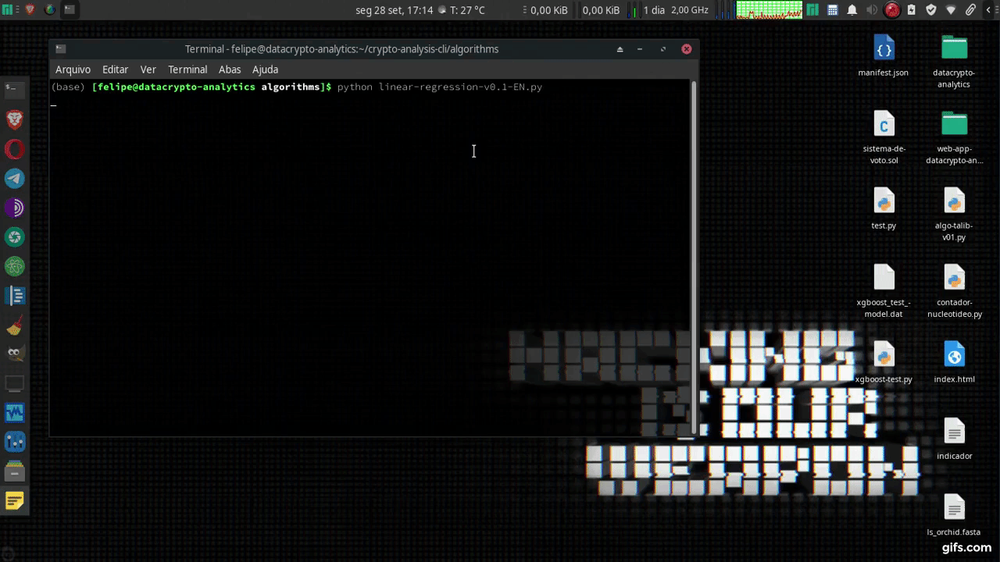

  <a> 3.2-blue.svg"></a>        
 
 

 <h1> <a rel="datacryptoanalytics" href="https://datacryptoanalytics.github.io/">DataCrypto Analytics </a></h1>
 <h3> <a rel="datacryptoanalytics" href="https://datacryptoanalytics.github.io/"> Quantitative Analysis Algorithms </a></h3>

  

------ 
 <h3> <a rel="datacryptoanalytics" href="https://datacryptoanalytics.github.io/">Descrição/Description </a></h3>

Algoritmos Machine Learning para o mercado de <b>Criptomoedas</b>. Desenvolvido com rede neural e árvore de decisões que analisa as possiveís movimentações do mercado.

- Observe que no site temos a página <b>Resultados</b>, está hospedado o <i>Backtesting</i> da nossa última versão, e em nosso canal no  <a rel="Youtube" href="https://www.youtube.com/channel/UCxfGBCV9E04Uw4flJLjBCqg?view_as=subscriberl">Youtube</a> vídeos de instalação e configuração.

------
Quantitative Machine Learning Algorithms for the <b> Cryptocurrencies </b> market. Developed with neural network and decision tree that analyzes the possible movements of the market.

- Note that on the website we have the <b> Results </b> page, the <i> Backtesting </i> of our latest version is hosted, and on our channel at <a rel = "Youtube" href = "https: //www.youtube.com/channel/UCxfGBCV9E04Uw4flJLjBCqg?view_as=subscriberl">Youtube </a> installation and configuration videos.

------

<h2><b> <a rel="datacryptoanalytics" href="https://github.com/datacrypto-analytics/crypto-analysis-cli/wiki/L%C3%B3gica">Lógica Algo XGBoost.py</a></b></h2>

-----

<h2><b> <a rel="datacryptoanalytics" href="https://github.com/datacrypto-analytics/crypto-analysis-cli/wiki/Instala%C3%A7%C3%A3o-Installation">Instalação/Installation</a></b></h2>

------

